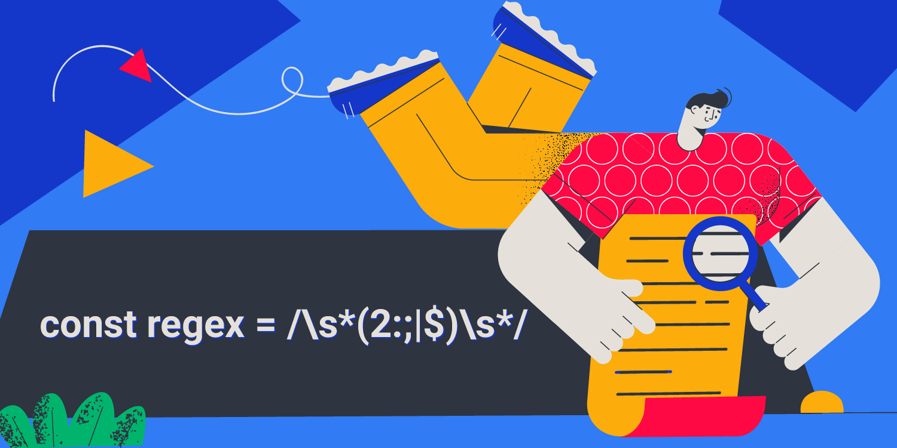

# 正则表达式

> 原文请查阅[这里](https://blog.sessionstack.com/how-javascript-works-regular-expressions-regexp-e187e9082913)，本文采用[知识共享署名 4.0 国际许可协议](http://creativecommons.org/licenses/by/4.0/)共享，BY [Troland](https://github.com/Troland)。

**这是 JavaScript 工作原理第二十七章。**



搜索，匹配和汇总是我们日常网络活动的重要组成部分。比如当你在浏览网页或 google 某些关键字时，就会进行大量搜寻。为了减少搜索/匹配的难度和提高精确度，诸如 Notepad 或 Sublime 等流行编辑器使用正则表达式来支持搜索和替换功能。因此当使用编辑器时你在在键盘上按 `CTRL + F` 时，就可以搜索和匹配选择的文本。

除了搜索，开发者可以使用正则表达式进行输入验证。例如，可以检查用户输入的 PIN 码是否全为数字，或者输入的密码是否具有特殊字符等。大多数开发者对正则表达式最喜欢的一点是其知识的可传递性。比如用 JavaScript 编写的正则表达式可以很轻松地迁移至 Python。

本文将解释 JavaScript 正则表达式，其重要性及特殊字符，还有如何有效地创建和编写它们，主要用例以及其不同的属性和方法。

## 什么是正则表达式

正则表达式是用于匹配字符串中字符组合的模式。在 JavaScript中，正则表达式也是对象。

正则表达式使得字符串搜索和匹配更轻松快捷。例如在搜索引擎，日志和编辑器等中，就需要轻松高效地过滤/匹配文本。这正是正则表达式的用武之地，它用一系列字符定义了搜索模式。

## 正则表达式的重要性

由于数字化转型的加速，信息成为越来越多的行业不可或缺的一部分。在本节我们将探索为什么正则表达式很重要以及它们在数据管理中的作用。

### 搜索/匹配字符串

大多数正则表达式的使用是用于执行字符串的搜索和匹配。 正则表达式允许开发者在大量文本池搜索。搜索文本时，如果找到匹配文本则返回 `true` ，反之为 `false`。从一组文本中匹配一个文本时，开发者会得到一个包含预期文本（即与搜索模式匹配的文本）的数组。

### 输入验证

对于大多数软件开发者，输入验证是一个重要功能。如果希望用户输入的 PIN 码全为数字，或正确使用 `@xx.com` 后缀输入电子邮件，实现类似功能时大多数开发者会使用到正则表达式。

下面是一个 RegExp 示例，以验证用户的输入确保他们的输入仅包含数字：

```js
let num = 1;
let regex = new RegExp('[0-9]');
console.log(regex.test(num)); // 返回值为 true
```

执行上面的代码会返回 `true`，因为 `num` 是介于0到9之间的数字。但是，如果将 `num` 的值更改为文本，则输出 `false`。


```js
let num = 'me';
let regex = new RegExp('[0-9]');
console.log(regex.test(num)); // 返回值为 false
```

### 网络爬虫

网络爬虫涉及从网站提取数据。使用正则表达式，开发者可以轻松地执行此任务。例如可以通过指向网页并提取与其模式匹配的数据来。

### 数据预处理

从网页抓取上的数据还有其他用处。比如基于决策目的，你可以评估来自网络的数据并整理成所需的格式。借助正则表达式可以聚合和映射数据以将其用于分析目的。

经过预处理的信息可以存储起来以备不时之需，使检索变得更加容易。

## JavaScript 创建 RegExp 对象

JavaScript 正则表达式是使用 RegExp 对象创建的。因此，正则表达式主要是JavaScript对象。前文使我们对正则表达式有了更好的了解，接下来我们一下如何在 JavaScript 中创建它们。

### 字面量 

字面量是在 JavaScript 中创建 RegExp 对象的一种方法。此方法涉及RegExp文字语法的使用。 RegExp 字面量将表达式用斜杠 `/` 包括而不是引号。

因为涉及 JavaScript 字面量的使用，也意味着这是运行时不能更改的固定值，使用字面量创建的正则表达式是一个常量。例如开发者不会想在循环中使用字面量。因为如果每次迭代后没有重新编译，则循环中的由字面量创建的值将不会改变。

以下代码是使用字面量创建 JavaScript 正则表达的语法：

```js
let re = /hello/
```

让我们再看一个简单例子，它会在字符串中寻找完全匹配的字符。这将执行区分大小写的搜索：

```js
let re = "Hello Studytonight";
let result = /hello/.test(re);
console.log(result); // 输出 false
```

上面代码的执行结果是 `false`，因为 `hello` 不等于 `Hello`，这是区分大小写的搜索。上面的命令执行的操作是在文本 `String Hello Studytonight` 中搜索 `hello`。我们可以使用不区分大小写的 `i` 修饰符执行不区分大小写的搜索。让我们使用 `i` 修饰符对上面的示例进行调整:

```js
let re = "Hello Studytonight";
let result = /hello/i.test(re);
console.log(result); // 输出 true
```

这次程序将输出true，因为没有执行区分大小写的搜索，所以 `Hello`等同于 `hello`。

### 构造函数

另一种创建正则表达式的方法是使用构造函数。此方法将正则表达式文本作为函数参数接收。从ECMAScript 6开始，构造函数现在可以接受正则表达式字面量。

需要注意的是使用构造函数创建的正则表达式，它们的模式可以在运行时发生改变。例如，在验证用户输入或执行循环迭代时。以下代码是使用构造函数创建 JavaScript 正则表达式的语法示例：

```js
let re = new RegExp('hello', 'g'); // 基于字符串构建
let re = new RegExp(/hello/, 'g'); // 基于正则表达式字面量构建 (ES6)
```

就像字面量示例一样，我们将使用 RegExp 构造函数创建区分大小写的搜索：

```js
let str = "Hello Studytonight";
let regex = new RegExp('hello');
console.log(regex.test(str)); // 输出 false
```

接下来，我们将`i`标志添加到函数参数中，以忽略搜索中的区分大小写。

```js
let str = "Hello Studytonight";
let regex = new RegExp('hello', 'i');
console.log(regex.test(str)); // 输出 true
```

现在由于区分大小写的忽略，因此代码将输出 `true`。

## 正则表达式方法

正则表达式有两个主要方法，分别是 `exec()` 和 `test()`。但还有其他用于正则表达式的 String 方法，如 `match()`，`matchAll()`，`replace()`，`replaceAll()`，`search()`和 `split()`。本节中我们将探讨用于 JavaScript 正则表达式的不同方法：

### exec()

此方法执行搜索并返回结果数组或 null，可用于获取字符串中多个匹配项。 比如下面示例展示了 `exec()` 分别使用循环和不使用的代码。

```js
//without iteration
let regex1 = RegExp('fam*', 'g');
let str1 = 'make family everything familiar';

str1 = regex1.exec(str1);
console.log(str1); //output fam, index:5

//with iteration
const regex1 = RegExp('fam*', 'g');
const str1 = 'make family everything familiar';
let array1;

while ((array1 = regex1.exec(str1)) !== null) {
  console.log(`Found ${array1[0]}. Next starts at ${regex1.lastIndex}.`);
  // outputs "Found fam. Next starts at 8."
  // outputs "Found fam. Next starts at 26."
}
```

> 注意在没有迭代的情况下仅获得第一个匹配项的索引。但是通过迭代可以获得所有（多个）匹配项的结果。

### test()

此 RegExp 方法搜索正则表达式和字符串之间的匹配项。如果找到匹配项，则返回 `true` 或 `false`。还可以对此方法使用全局标志`g`。让我们看一个示例，在带和不带全局标志 `g` 的字符串中搜索正则表达式。

```js
const str = 'in a space of time spark';
const regex = new RegExp('spa');
const globalRegex = new RegExp('spa', 'g');
console.log(regex.test(str));
// output: true
console.log(globalRegex.test(str));
// output: true
```

在上面示例中，`regex.test(str)` 和 `globalRegex.test(str)` 均输出 `true`，因为可以在文本（`space` 和 `spark`内）找到匹配的 `spa`。

但全局标志允许开发者在搜索中进行迭代，以确定目标字符串中存在 `spa` 的次数及不同出现位置的索引。没有全局标志的话是无法实现的，因为 `test()`方法将在字符串中运行，从而确定 `spa` 是否存在，而不考虑它是否出现过一次或多次。下面代码对此进行了更好的解释：

```js
const str = 'in a space of time spark';
const regex = new RegExp('spa');
const globalRegex = new RegExp('spa', 'g');
console.log(regex.test(str));
//output: true
console.log(regex.lastIndex);
// doesn’t matter what position. spa is present so it outputs 0
console.log(regex.test(str));
//output: true
console.log(regex.lastIndex);
// doesn’t matter what position. spa is present so it outputs 0
console.log(regex.test(str));
//output: true
console.log(regex.lastIndex);
// doesn’t matter what position. spa is present so it outputs 0
console.log(globalRegex.test(str));
// output: true
console.log(globalRegex.lastIndex);
// output: 8
console.log(globalRegex.test(str));
// output: true
console.log(globalRegex.lastIndex);
// output: 22
console.log(globalRegex.test(str));
// output: false
console.log(globalRegex.lastIndex);
// output: 0 (because spa only occurs in position 8 and 22)
```

`test` 方法的语法为 `test(str)`。`str` 是要匹配正则的字符串。与 `search()` 方法不同，此方法返回一个布尔值而不像 `search()` 返回匹配项的索引；如果找不到匹配项，则返回 -1。

### match()

此方法返回与正则表达式与文本匹配的结果数组而不是布尔值。让我们看一个示例，该示例将使用全局标志查找字符串中的所有匹配字母。全局标志用于遍历文本每个字母进行匹配。

```js
const paragraph = 'TheGirl Fakesa Smile.';
const regex = /F(a)[a-z]/g;
const found = paragraph.match(regex);
console.log(found); // Should return ["Fak"]
```

> 如果输入正则对象作为参数直接使用 `match()` 方法，则会得到一个空字符串数组。如果在此方法中不使用全局标志，则会得到与 `exec()`方法相同的结果。另外此方法还支持使用其他属性，比如[`groups`, `index`, `input`](https://developer.mozilla.org/en-US/docs/Web/JavaScript/Reference/Global_Objects/String/match#return_value)等。

### matchAll()

`matchAll()` 方法必须配合全局标志来使用。与 `match()` 方法的区别在于它返回具有所有匹配组和捕获组的迭代器。在 `match()` 方法中，使用`g`标志不会返回捕获组，没有`g`标志的情况下将返回第一个匹配项以及相关捕获组。

全局标志对于 `matchAll()` 很重要，否则会报错。让我们看一下用`matchAll()`方法来执行 `match` 方法中的例子。

```js
const paragraph = "TheGirl Fakesa Smile.";
const regex = /F(a)[a-z]/g;
const found = paragraph.matchAll(regex);

//should print (2) ["Fak", "a", index: 8, input: "TheGirl Fakesa Smile.", groups: undefined].
Array.from(found, (res) => console.log(res)); 
```

上面的示例中返回了捕获组 `a`。在 `match()` 示例中则未返回此值。另外二者的语法是相同的。

### replace()

```js
const p = 'The girl is a beautiful girl';
console.log(p.replace('girl', 'lady'));
//output: "The lady is a beautiful girl"
 
const regex = /girl/i;
console.log(p.replace(regex, 'woman'));
// output: "The woman is a beautiful girl"
```

上面例子中可以看到初始字符串 `p` 不变。产生变化的是返回结果。另外，第二个字符串 `girl` 也保持不变。 此方法语法如下所示：

```js
// for RegExp pattern
replace(regexp, newSubstr)
replace(regexp, replacerFunction)
// for String Pattern
replace(substr, newSubstr)
replace(substr, replacerFunction)
```

### replaceAll()

此方法适用于使用正则替换文本中所有匹配文本。在 `replace()` 方法中，仅模式匹配的第一个文本被替换。但在 `replaceAll()` 会将所有匹配文本替换掉。让我们来看一下 `replace()` 方法中的相同示例。 二者的语法相同：

```js
const p = 'The girl is a beautiful girl';
console.log(p.replaceAll('girl', 'lady'));
//output: "The lady is a beautiful lady"
 
const regex = /girl/g;
console.log(p.replaceAll(regex, 'woman')); //output: "The woman is a beautiful woman"
```

### search()

搜索方法 `search()` 用于搜索正则表达式和字符串间的匹配项。此方法不输出布尔值或结果数组。而是输出一个数字，显示第一个匹配项的索引。

例如，下面的示例输出 4，为第一个大写 `S` 的索引。

```js
let str = "the Soup Is Sour"
let re = /[A-Z]/g
console.log(str.search(re)) //This should output 4
```

### split()

> 非正则对象的方法

`split` 方法用于从字符串中提取子字符串。此方法的作用是根据我们的模式将字符串分为子字符串。然后，它将返回一个包含所有子字符串的数组。比如可以使用该方法将字符串分割为单词，字符等。

```js
const str = 'The house is beautiful and spacious';
const words = str.split(' ');
console.log(words[3]);
//output: "beautiful"
 
const chars = str.split('');
console.log(chars[8]);
//output: "e"
 
const strCopy = str.split();
console.log(strCopy);
//output: Array ["The house is beautiful and spacious"]
```

`split` 方法的相关语法如下：

```js
split()
split(separator)
split(separator, limit)
```

分隔符描述每个拆分应该在哪里发生。分隔符可以是字符串或正则表达式。开发者传入参数 `limit`，此参数规定了包含数组中的子字符串数量。例如，如果 `limit` 为 0，则将返回一个空数组 `[]`。

## 总结

翻到一半没有兴趣了，感觉大部分内容其实可以直接查看[这里](https://developer.mozilla.org/zh-CN/docs/Web/JavaScript/Guide/Regular_Expressions)。自从换了作者后此系列文章质量下降有点大，后续可能不会继续翻了。